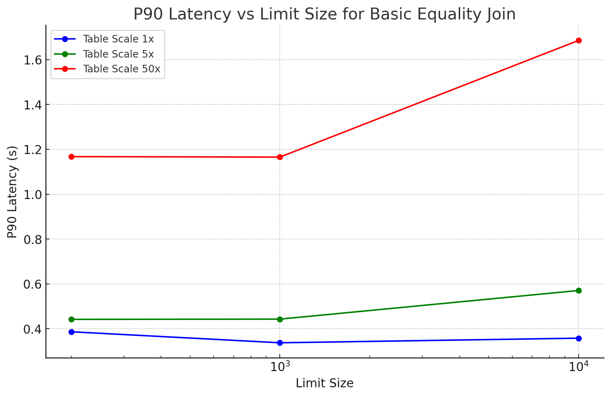

## Summary
Test Calcite join with OpenSearch 2.17, Understand the latency and limitation.

## Prepare Dataset
* load http_logs
```
opensearch-benchmark execute-test \
  --workload http_logs \
  --pipeline benchmark-only \
  --target-hosts http://localhost:9200
```

## Test Steps
```
./bin/opensearch

python3.11 join_benchmark.py
```

## Results
* **Analysis**

    * **Impact of Table Size:**
        * Small and medium tables handle increasing `LIMIT` sizes efficiently.
        * For the largest table, latency grows significantly, particularly for larger result sets (`LIMIT = 10000`).
    * **Impact of Result Size (`LIMIT`):**
        * Small and medium tables show minimal latency variation as `LIMIT` increases.
        * Large tables experience noticeable latency increases, reflecting the cost of processing more data.
* **Scripts**, https://github.com/penghuo/os-sql/blob/poc/calcite-2.17-sql/join_benchmark.py
* **Result**

```
query_name,table_size,limit_size,p90_latency,rows_returned
basic_equality_join,logs-181998,200,0.3865773677825928,200
basic_equality_join,logs-181998,1000,0.3374903917312622,1000
basic_equality_join,logs-181998,10000,0.35803589820861814,10000
basic_equality_join,logs-201998,200,0.4419751405715942,200
basic_equality_join,logs-201998,1000,0.44304029941558837,1000
basic_equality_join,logs-201998,10000,0.5706516981124878,10000
basic_equality_join,logs-241998,200,1.1678275346755982,200
basic_equality_join,logs-241998,1000,1.1656768321990967,1000
basic_equality_join,logs-241998,10000,1.685919499397278,10000
```